<div align="center">


# Zovita+

**Care, delivered with calm.**
An online pharmacy with 1,000+ real medicines, syrups and supplements, a 3D symptom body map, a guided assistant, a store that adapts to each shopper, drug-interaction warnings, refill reminders, pharmacist-reviewed prescriptions, English and Urdu, and card payments or cash on delivery. Staff work in a role-based admin panel with optional authenticator-app two-step sign-in.

[](https://github.com/ahmershahdev/zovita/actions/workflows/ci.yml)


[](LICENSE)

[Features](#features) · [Screenshots](#screenshots) · [Stack](#stack) · [Data model](#data-model) · [Security](#security) · [SEO](#seo--ai-discoverability) · [Testing](#testing--results) · [Getting started](#getting-started) · [Deployment](#deployment) · [Roadmap](#roadmap)

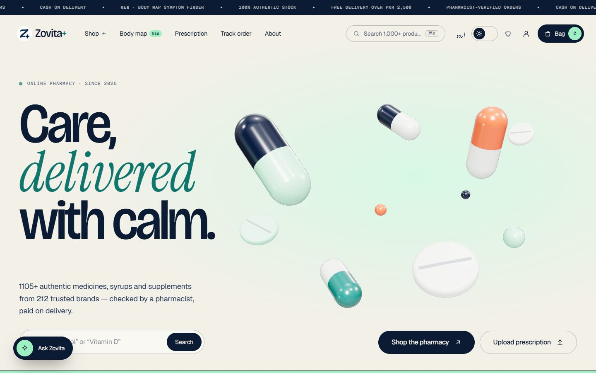

**Live:** [zovita.ahmershah.dev](https://zovita.ahmershah.dev)

</div>

---

## Features

### Storefront
- **1,186 products** across 8 departments, 118 categories and 212 brands, with real names, prices, discounts, stock, prescription flags, generics, uses, dosage, precautions and warnings.
- **Local WebP images** in two sizes (640/320), served with `srcset`. `catalog:cache-images` downloads each image, rejects placeholder images (perceptual hash plus colour check) and audits what's already cached.
- Server-side filters (category, brand, form, Rx/OTC, stock, price), sorting, pagination and ⌘K instant search with suggestions.
- **Product pages:**
  - Photo and 3D pack viewer, with delivery estimate by city.
  - Price-insight histogram against the category.
  - "Same salt, other brands" and recently viewed.
  - `Product` JSON-LD.
- **Sold out?** In-stock alternatives are matched by active ingredient, then category and price, with a one-tap swap in the bag.
- **3D body map:**
  - A sculpted SDF mannequin baked offline into a 456 KB Brotli mesh with per-vertex body regions.
  - Rotate it, tap where it hurts and pick a symptom. You get self-care tips, red flags and pharmacist picks.
  - Emergency symptoms show urgent-care guidance instead of products.
- **Motion:**
  - Fly-to-bag and fly-to-wishlist flights: a parcel with a motion trail, particles, a landing ring and a "+1".
  - Moving items between the bag, wishlist and "saved for later" uses the same flights, plus a heart-break effect when you unsave.
  - A capsule cursor that changes with what it's over.
  - GSAP/Lenis scrolling and SplitText reveals.
  - Everything respects `prefers-reduced-motion`.

### A store that adapts to each shopper
- Every visitor (signed in or guest) builds a quiet profile: views, time on page, bag adds and purchases per product (`product_interactions`).
- **Automatic offers.** An offer engine turns behaviour into personal discounts, capped at 15%, time-limited, and locked in and redeemed inside the order transaction:

  | Behaviour | Offer |
  |---|---|
  | Kept coming back to a product without buying | Hesitation: 8% on that product, 3 days |
  | Left an item in the bag | Bag rescue: 5% on that item, 2 days |
  | Buys the same product repeatedly | Regular: 10% on it, 1 week |
  | First visit with no orders | Welcome: 5% off the first order |
  | Several orders | Loyalty: 5–10% off the next order |
  | Inactive for a while | Comeback: 7% off |
- Personal recommendations ("picked for you", "buy again", "pairs well with") and a recently-viewed rail.
- **A/B experiments** (e.g. the hero call to action):
  - Stable crc32 bucketing per visitor.
  - De-duplicated exposure and conversion events.
  - Results are shown in the admin panel.
  - **Variants stick through sign-in**: the variant a guest saw is stored and carried into their account, unless the account already has one (another device), so nobody switches buckets or is counted twice.

### Guided assistant
- A chat panel with **no free-text box**. The shopper picks from preset questions, so there are no prompt injections, no hallucinated medical advice and no PII typed into a bot.
- Answers are built on the server and personalised: where *my* order is, what's in *my* bag, *my* offers, *my* prescription status, reorder suggestions, delivery and returns rules.

### Ordering
- Session bag with prices re-read from the database, a free-delivery threshold and per-order caps.
- **Drug-interaction warnings** in the bag and at checkout, built from the active ingredients stored on every product (`generics`):
  - Ingredients are matched to drug classes (NSAIDs, blood thinners, SSRIs, nitrates, macrolides/azoles, statins, minerals and more) by tolerant patterns, so the catalogue's own spellings ("Domeperidone Maleate") still match.
  - 24 conservative, well-established rules in `resources/content/interactions.json`: two paracetamol products, blood thinner + NSAID, sildenafil + nitrate, SSRI + tramadol, quinolone + antacid/iron, domperidone + clarithromycin and others, each with what to do.
  - Creams, shampoos, eye drops and other topical forms are ignored, so a ketoconazole shampoo never warns about a statin.
  - A **serious** warning must be acknowledged before the order goes through; the warnings are stored on the order for the pharmacist.
- **Card payments** alongside cash on delivery (Stripe Checkout in production, a built-in sandbox gateway locally):
  - The order is created "awaiting payment" with its stock reserved for 30 minutes; only a **signed, fresh, never-seen-before webhook** with the right amount and currency marks it paid. The return page never does.
  - Unpaid orders are cancelled and restocked by `payments:expire`, with their offers released. Money that arrives after that is **refunded automatically**.
  - Owners refund part or all of an order from the admin panel; refunds can never exceed what was captured, and cancelling a paid order refunds the card.
- **Cash-on-delivery checkout:**
  - Stock is decremented under `SELECT … FOR UPDATE` row locks, so two shoppers can never buy the last unit twice.
  - A per-checkout idempotency token stops double submits.
- Prescription upload is required when the bag has Rx medicine. Files are private and never web-accessible.
- Order tracking by number plus email, and order history for customers.
- **Refill reminders** for medicines bought again and again: the "buys it regularly" signal picks candidates, the customer's real order dates give the rhythm (median gap, 7–120 days), and an e-mail goes out 3 days before they run out, **once per purchase cycle**, with a signed one-tap "put it back in my bag" link. Customers see "Refills due" on their account and can switch the e-mails off.

### Accounts
- Register, sign in and password reset.
- **Profile:**
  - Avatar upload, email, phone and password.
  - Address with an **OpenStreetMap picker**: drag the pin, search an address or use your location.
- Every account gets a **readable random username** (e.g. `calm-heron-4821`). Only an admin can change it.
- Recent sign-ins (device, browser, approximate place) on the security tab.
- Optional **two-step sign-in** with any authenticator app (TOTP, RFC 6238), eight single-use recovery codes, and replay protection: a code can't be used twice.
- **Passwordless "e-mail me a code" sign-in**: a 6-digit code that works once and expires in 10 minutes; the screen looks the same whether or not the address has an account (no enumeration), and accounts with an authenticator still need its code afterwards.
- **E-mail automation** (all on one branded template, sent through Resend):

  | E-mail | When |
  |---|---|
  | Welcome + **confirm your e-mail** | Sign-up, and after changing the e-mail address (signed link, **expires in 10 minutes**, resend button on the account page) |
  | **Sign-in code** | E-mail-code sign-in and staff second step (6 digits from a CSPRNG, stored only as an HMAC under a unique index, 10 minutes, single use, 5 tries, one per minute) |
  | **Password reset** | "Forgot password?" (64 random characters, stored hashed, single use, **expires in 10 minutes**) |
  | **New sign-in alert** | A sign-in from an IP not seen on the account in 90 days |
  | Order confirmed / **status updates** / **refund issued** | Checkout (COD) or payment webhook (card), every status change, every refund |
  | Prescription received / decision, refill reminders | As before |
- Guest wishlist and activity merge into the account on sign-in.

### Admin panel (`/admin`, separate staff login)
- **Hidden and gated:**
  - Its own sign-in at `/admin/login` with e-mail and password. Once a staff member turns on an authenticator app from **My security** in the panel, every later sign-in also asks for its 6-digit code (recovery codes cover a lost phone). A session that didn't come through the staff sign-in (a customer session, a remember-me cookie) is refused.
  - Every admin URL returns **404** to anyone who isn't staff.
  - Sessions sign out after 30 minutes idle.
  - Staff login is throttled for 15 minutes after failures.
- **"Today at Zovita"** dashboard:
  - To-do cards: prescriptions to review, orders to confirm, low and sold-out stock.
  - Revenue, orders, average order and new customers against the previous period.
  - Charts: revenue per day, shopper funnel, top products, departments, A/B results.
  - Every chart has a table view.
- **Written for non-technical staff:** a "How this page works" guide on every page, a **?** next to every heading with a plain-language explanation, and big status pills.
- **Prescriptions:**
  - Accept, reject or leave pending, with a note to the customer (emailed).
  - Anything not reviewed within **24 hours is accepted automatically** (the scheduler runs `prescriptions:auto-approve` every 10 minutes and labels these "auto-approved").
- **Customers:**
  - Search, filters and a full **activity timeline**: sign-ins, views, bag, orders, prescriptions, profile changes, with device and IP.
  - Username editing.
- **Bans**, through a guided wizard:

  | Severity | Effect |
  |---|---|
  | **Temporary** (1 day / 1 week / 1 month / custom) | Account locked until the date |
  | **Permanent** | Account locked; the email, phone and device can't register again |
  | **Deep** | Also blocks the IP, its network (/24 IPv4, /64 IPv6) and browser fingerprint across the whole site |

  - Email matching is canonical: Gmail dots and `+aliases` are folded, so `j.o.h.n+1@gmail.com` = `john@gmail.com`.
  - A banned person who signs in sees a calm "account suspended" page with the reason and end date.
- Orders (status workflow, card payment and refunds) and products (stock and price at a glance).
- **Staff roles**, enforced on every admin route and reflected in the sidebar:

  | Role | Can |
  |---|---|
  | **Owner** | Everything, including refunds, bans and managing staff |
  | **Pharmacist** | Prescriptions, stock and prices, moving orders along |
  | **Support** | Orders, customer profiles and usernames (no refunds, no bans) |

  The owner adds staff by e-mail, changes roles, removes access and resets a lost phone's two-step sign-in. The last owner can never be demoted.

### Languages
- **English and اردو (Urdu)**: a full right-to-left layout and Noto Nastaliq Urdu.
- A 621-entry dictionary, switched instantly with no reload. `hreflang` alternates are in the sitemap and `<head>`.

### Speed
- **Server-side rendering** (Inertia SSR, `npm run build:ssr` + `php artisan inertia:start-ssr`): every storefront page arrives as full HTML and hydrates without a mismatch. The head (title, meta, JSON-LD) stays server-rendered by Blade, so there are no duplicate tags.
- Inertia SPA: no full page reloads.
- Hovering a link **prefetches** its data and warms its JS chunk.
- Long-lived immutable caching for hashed assets, plus Brotli and gzip.
- Theme toggle with a circular View Transition and no flash.
- Branded loading, 404, 419, 429, 500 and 503 pages.

## Screenshots

| | |
|---|---|
| 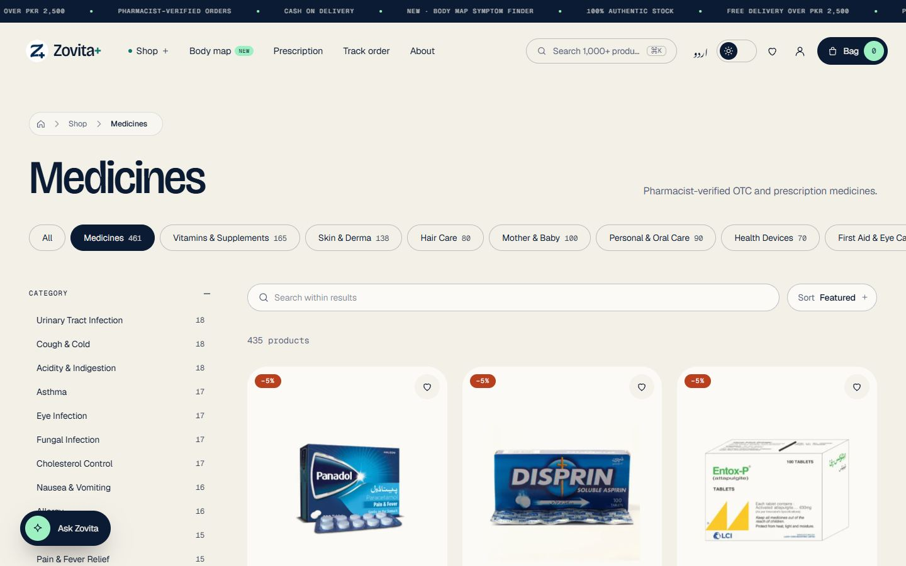 | 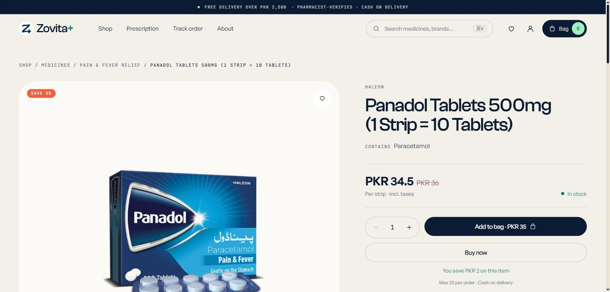 |
| **Shop**: filters, sorting, 1,000+ products | **Product**: price insight, alternatives, delivery estimate |
| 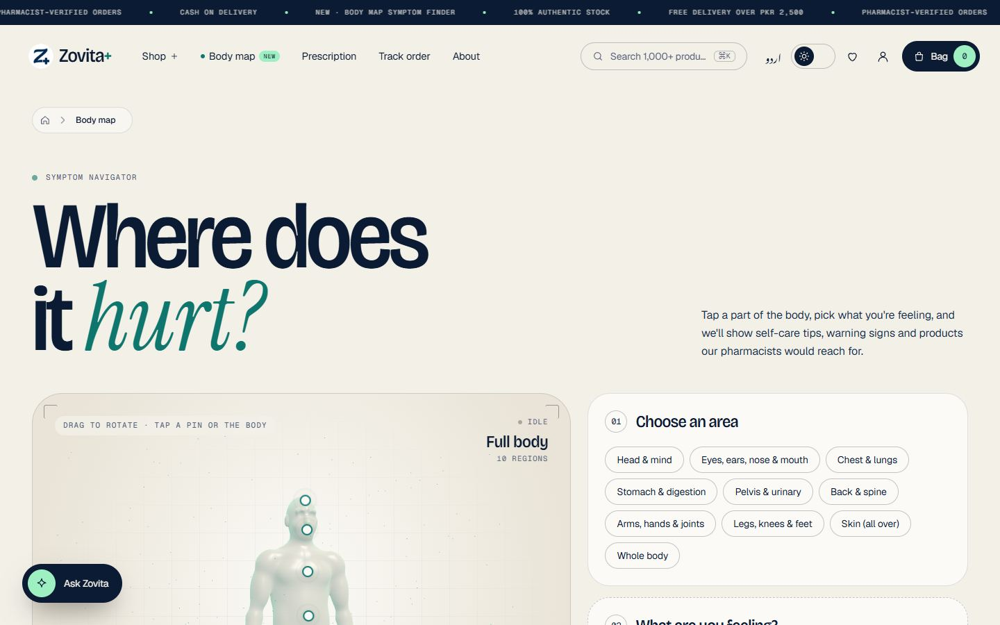 | 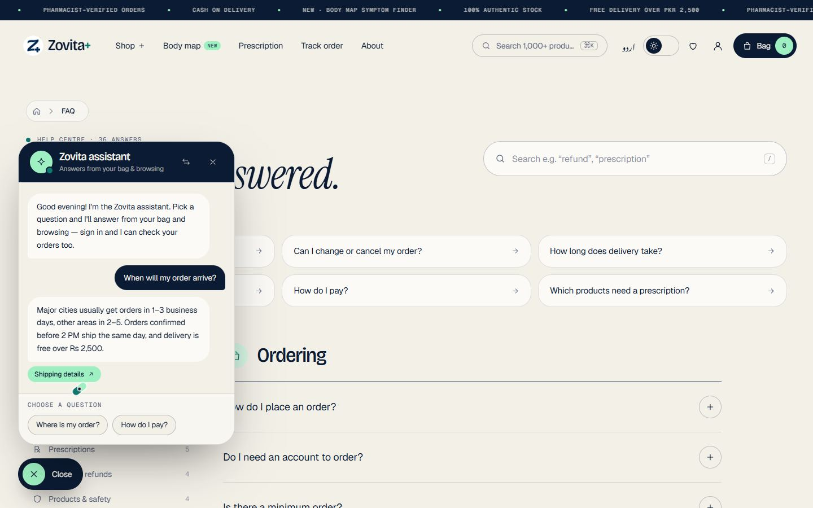 |
| **3D body map**: tap where it hurts | **Assistant**: preset questions, personal answers |
| 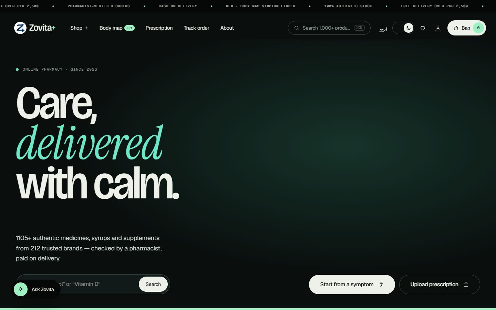 | 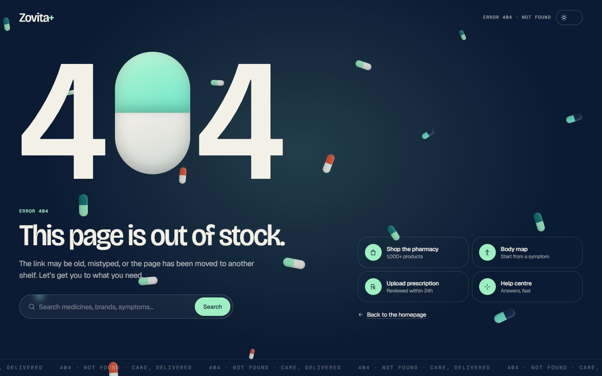 |
| **Dark theme** | **404**: search and shortcuts instead of a dead end |
| 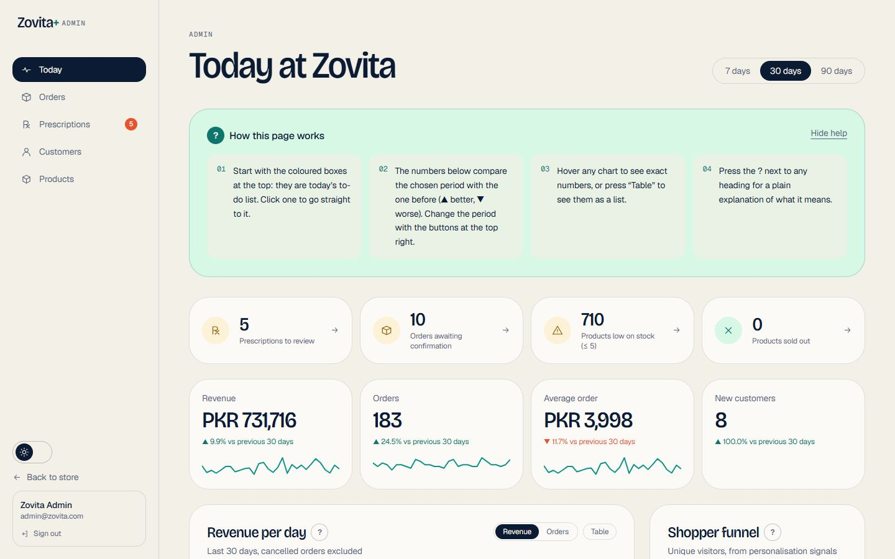 | 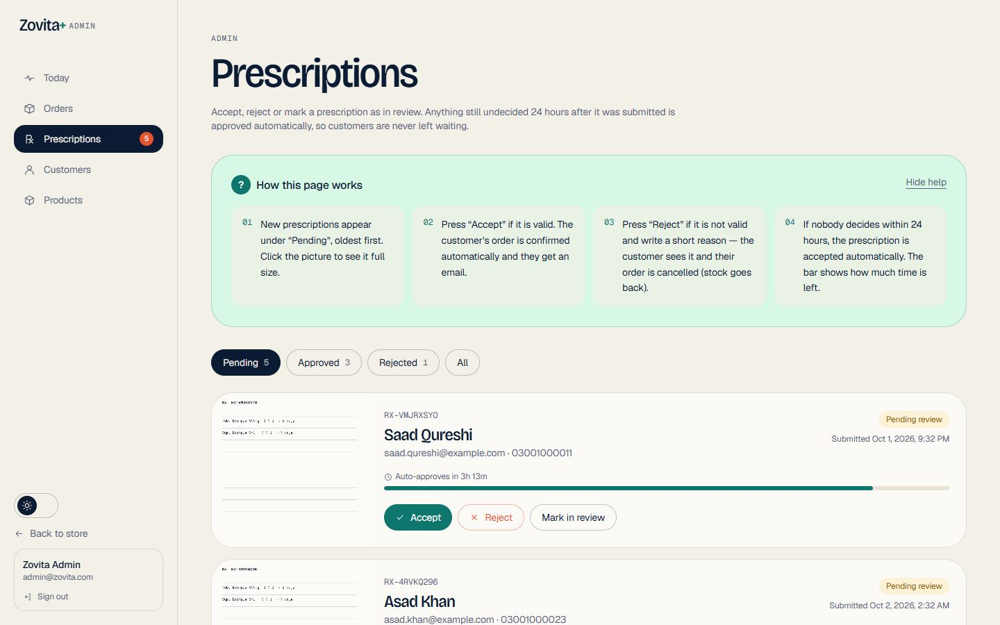 |
| **Admin: Today at Zovita** | **Prescription review** with 24 h auto-accept |
| 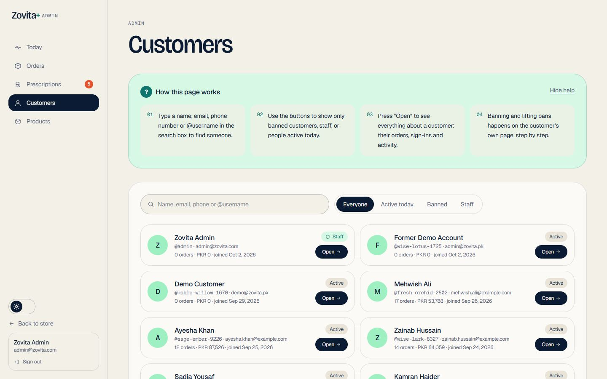 | 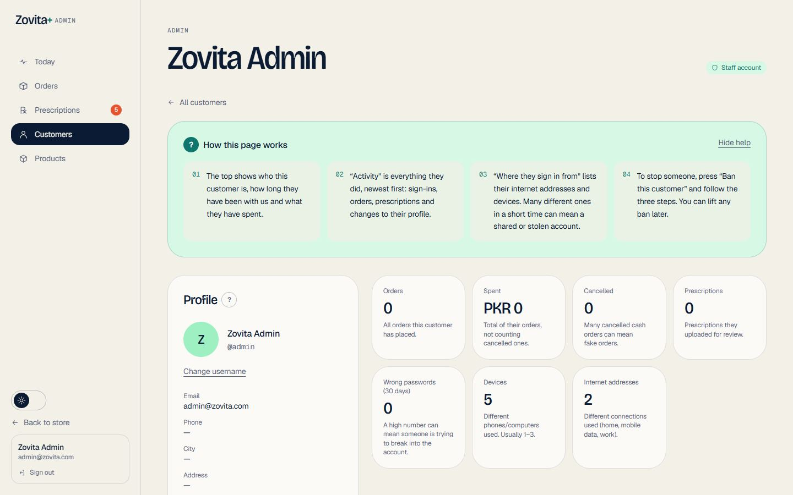 |
| **Customers** | **Customer detail**: activity, username, ban wizard |

<p align="center">
  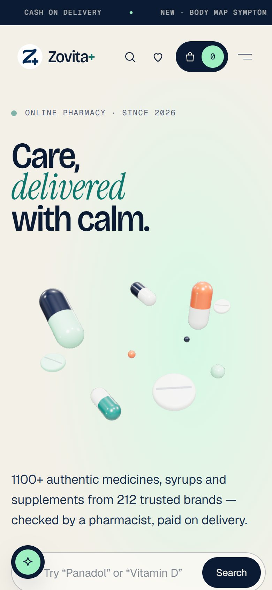
  &nbsp;&nbsp;
  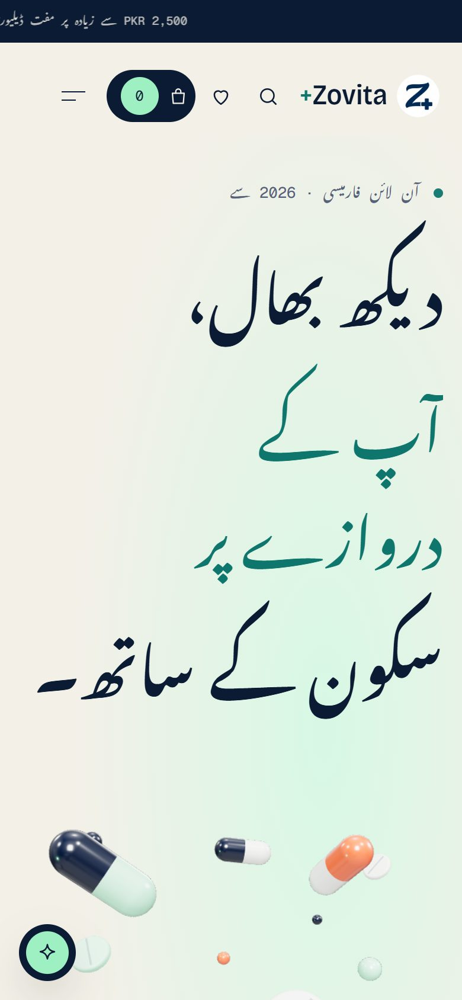
</p>

## Stack

| Layer | Tech |
| --- | --- |
| Backend | PHP 8.2 · Laravel 12 · MySQL / MariaDB |
| Frontend | React 19 · Inertia.js 2 · Tailwind CSS 4 · Vite 7 · Ziggy |
| Motion & 3D | GSAP 3 (ScrollTrigger, SplitText) · Lenis · Three.js + React Three Fiber (custom shader) |
| Maps | Leaflet · OpenStreetMap tiles · Nominatim geocoding |
| Email | Resend |
| Bot protection | Google reCAPTCHA v3 (invisible, scored) + v2 (themed checkbox) |
| Quality | PHPUnit · Playwright · Lighthouse · autocannon · Laravel Pint · GitHub Actions · Dependabot alerts |

## Data model

22 domain tables and 27 foreign keys, grouped into catalogue, orders and payments, customers and staff, personalisation (refills and A/B included), security and inbox. Every column is shown, generated from the live MySQL schema.

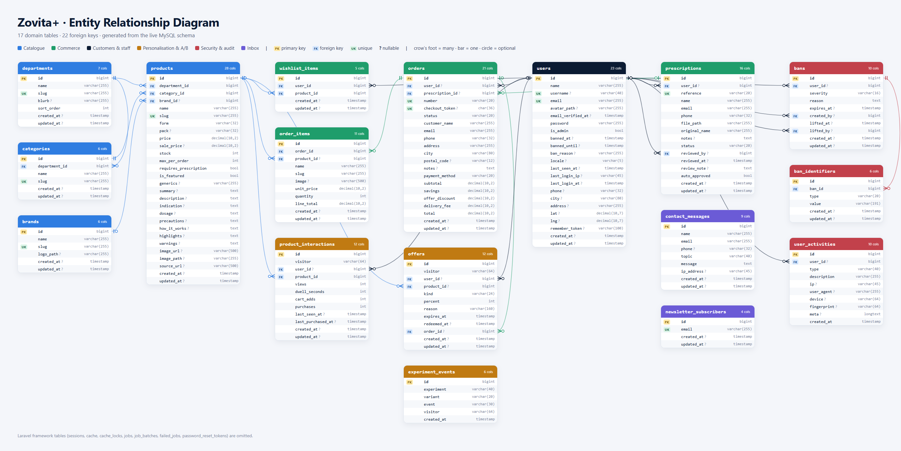

<details>
<summary><b>Simplified relationship view (Mermaid)</b></summary>

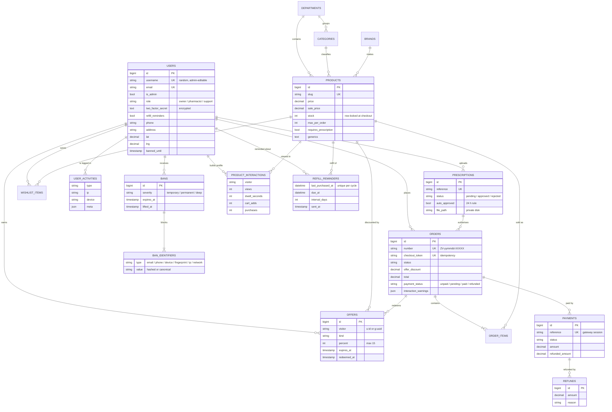

</details>

Also: `experiment_events` and `experiment_assignments` (A/B), `webhook_events` (each gateway event applied once), `contact_messages`, `newsletter_subscribers`, plus Laravel's `sessions`, `cache` and `jobs`.

## Security

| Threat | Defence |
| --- | --- |
| **SQL injection** | Eloquent / query builder with bound parameters everywhere; sort and filter values are allow-listed; no raw user input in SQL. Covered by tests with classic payloads. |
| **XSS** | React escapes by default; no `dangerouslySetInnerHTML` with user data; **nonce-based CSP** (`script-src 'self' 'nonce-…'` plus Google's reCAPTCHA hosts), so no inline script runs without the per-request nonce. |
| **CSRF** | Laravel CSRF tokens on every state change (Inertia sends `X-XSRF-TOKEN`); `SameSite=Lax` cookies. |
| **Clickjacking, sniffing, leaks** | `frame-ancestors 'self'`, `X-Content-Type-Options`, strict `Referrer-Policy`, `Permissions-Policy`, HSTS in production. |
| **Brute force** | Per-route throttles, **each with its own counter** (busy shopping never eats into checkout's budget); 5 failed sign-ins lock for 1 minute, or 15 minutes on the staff login; reCAPTCHA v3/v2. |
| **DoS / floods** | `RequestGuard` rejects unexpected methods, absurdly long URLs, parameter floods, oversized bodies and NUL bytes before any session or database work happens; a site-wide budget per client (300 reads/min; writes 60/min and 8/s) with an allow-list for health checks; nginx `limit_req` and `limit_conn` at the edge (see `deploy/nginx.conf`). |
| **Race conditions** | Stock is decremented inside a transaction with `lockForUpdate()`, and quantities are re-validated under the lock; idempotency tokens stop double orders; offers are redeemed under the same lock. |
| **Enumeration** | Password reset, login and order tracking return identical responses whether or not the account or order exists. |
| **Uploads** | MIME and extension allow-list, size cap, UUID file names, private disk, streamed to admins only. |
| **Abuse by banned users** | Temporary, permanent and deep bans matched on canonical email, phone, device cookie, browser fingerprint, IP and network. |
| **Admin exposure** | 404 for non-staff, separate login, **mandatory second step** (e-mailed 10-minute single-use code, or replay-proof TOTP with hashed single-use recovery codes; five wrong codes restart the sign-in), **role permissions** on every route, idle timeout, every admin action written to the activity log. |
| **Payments** | Amounts computed on the server; webhooks verified with HMAC-SHA256 (`t=…,v1=…`, constant-time compare, 5-minute replay window); every event id stored once; amount and currency must match; order and payment rows locked for every state change; idempotency keys on gateway calls; refunds capped at what was captured. |
| **Malicious uploads** | Prescriptions and avatars are streamed to **ClamAV** (`clamd` INSTREAM over TCP or a Unix socket) before they are stored; an unreachable scanner refuses the upload unless explicitly configured to fail open. |
| **Multi-server abuse controls** | Rate-limit counters (`CACHE_LIMITER_STORE`) and ban look-ups (`BAN_CACHE_STORE`) live in a shared store (**Redis** in production); issuing or lifting a ban bumps a version key so every server stops trusting cached answers at once, and cached hits are re-checked so an expired ban is never enforced. |

**Scaling.** The app is stateless (sessions, cache and queue in the database, or Redis in production), so it runs behind any load balancer. `deploy/nginx.conf` ships an upstream with health checks, edge rate limiting and static caching. `deploy/supervisor.conf` runs queue workers and the scheduler. `TrustProxies` is configured so client IPs survive the balancer.

Report vulnerabilities privately: see [SECURITY.md](SECURITY.md).

## SEO & AI discoverability

- **Per page:** a unique `<title>` and meta description, a canonical URL, Open Graph and Twitter cards, `robots`, and `hreflang` (en / ur / x-default).
- **JSON-LD:**
  - Site-wide: `Pharmacy`/`OnlineStore` and `WebSite` with `SearchAction`.
  - Per page: `Product` (offers, availability, brand), `BreadcrumbList`, `FAQPage`, `ItemList` and `ContactPage`.
- **One `<h1>` per page** with a logical heading outline.
- **[`/sitemap.xml`](https://zovita.ahmershah.dev/sitemap.xml)** lists every product, department, category, brand and page, with `lastmod` and language alternates.
- **[`/robots.txt`](https://zovita.ahmershah.dev/robots.txt)** allows search engines and named AI crawlers (GPTBot, ClaudeBot, PerplexityBot, Google-Extended…) and keeps them out of the bag, checkout, account and admin areas.
- **[`/llms.txt`](https://zovita.ahmershah.dev/llms.txt)** is a concise guide to the site for AI agents. **[`/llms-full.txt`](https://zovita.ahmershah.dev/llms-full.txt)** adds the full FAQ, policies, departments and how ordering works.
- Private pages (bag, checkout, account, auth) are `noindex`.

## Testing & results

| Suite | What it covers | Result |
|---|---|---|
| **PHPUnit** (`php artisan test`) | Cart and checkout (stock locking, idempotency, throttle isolation), auth, bans and evasion, personalisation and offers, assistant, A/B (incl. sticky variants), admin gating, prescriptions and the 24 h auto-accept, security (SQLi, XSS, CSP, CSRF, rate limits), SEO outputs; **TOTP against the RFC 6238 test vectors**, staff set-up, replay and lock-out, recovery codes, every role's permissions, last-owner protection; **e-mailed codes** (hashed, 10-minute expiry, single use, resend), passwordless sign-in without enumeration, 10-minute confirmation and reset links, sign-in alerts, order e-mails; **payments** (signed/forged/stale/duplicate/wrong-amount webhooks, expiry and restock, late-payment refund, partial and full refunds, Stripe request shape); drug interactions; refill rhythm and once-per-cycle e-mails; ban cache invalidation; ClamAV against a real socket speaking the INSTREAM protocol | **145 passed** (973 assertions) |
| **Playwright** (`npx playwright test`) | Smoke test of every page on desktop and mobile (no console errors, one `h1`, no horizontal scroll), fly-to-bag, wishlist ↔ bag moves, guest checkout, themed dropdown keyboard use, body map, assistant, Urdu RTL round-trip, A/B exposure, hover prefetch, admin review with two-step sign-in, admin pages on a phone, interaction warning + acknowledgement, card payment through the sandbox gateway, retrying a cancelled payment, staff pages | **56 passed** |
| **Lighthouse 13** | Home, shop, product, body map, FAQ, contact, policies, login, register, prescription, about | **Accessibility 100 · Best Practices 100 · SEO 100** (bag/checkout are `noindex` by design) |
| **Load** (`node tests/load/run.mjs capacity`) | On a single XAMPP dev box (database sessions): shop and product pages about 32 req/s at p50 about 700 ms; FAQ about 55 req/s; static images about 830 req/s at 11 ms | No errors |
| **Responsive sweep** | Every storefront, account, checkout, payment and admin page at 320, 375, 414, 768, 1024, 1280 and 1920 px (259 page × width combinations) | **No sideways scroll** |
| **SSR hydration** | 15 storefront pages, desktop and phone, rendered by the SSR server and hydrated in Chrome | **No hydration errors** |
| **Abuse** (`node tests/load/run.mjs abuse`) | 25 connections flooding `/shop` from one client for 20 s | 293 served, then **429 for the rest**, with no 5xx |

```bash
php artisan test
RECAPTCHA_ENABLED=false RATE_LIMIT_ALLOWLIST=127.0.0.1 APP_URL=http://127.0.0.1:8123 php artisan serve --port=8123
npx playwright test
RATE_LIMIT_ALLOWLIST=127.0.0.1 node tests/load/run.mjs capacity http://localhost/zovita
node tests/load/run.mjs abuse http://localhost/zovita
```

## Getting started

**Requirements:** PHP 8.2+ (`pdo_mysql`, `mbstring`, `gd`, `fileinfo`), Composer, Node 20+ and MySQL/MariaDB. XAMPP works.

```bash
git clone https://github.com/ahmershahdev/zovita.git && cd zovita
composer install && npm install
cp .env.example .env && php artisan key:generate

# create an empty database called "zovita", then:
php artisan migrate --seed          # catalogue, demo customer, admin account
php artisan storage:link
php artisan catalog:cache-images    # download product images as responsive WebP

npm run build                       # or `npm run dev` for hot reload
php artisan serve                   # → http://127.0.0.1:8000
```

| Account | Sign in at | Email | Password |
|---|---|---|---|
| Owner (admin) | `/admin/login` | `admin@zovita.com` | `Admin@1234` |
| Pharmacist | `/admin/login` | `pharmacist@zovita.com` | `Pharma@1234` |
| Support | `/admin/login` | `support@zovita.com` | `Support@1234` |
| Demo customer | `/login` | `demo@zovita.pk` | `password` |

Staff sign in with just their e-mail and password, so the seeded demo accounts work out of the box. After signing in, open **My security** in the panel to turn on two-step sign-in with an authenticator app; from then on that account also needs the app's code.

> **Change the staff passwords before going live.** Use `php artisan user:admin you@example.com --role=owner` to promote your own account, then `php artisan user:admin admin@zovita.com --revoke` (or delete it).

**XAMPP:** clone into `htdocs/zovita` and set `APP_URL=http://localhost/zovita`. The root `.htaccess` routes requests into `public/`. Don't run `php artisan route:cache` under a subfolder install: the subfolder prefix breaks the compiled routes. It works normally when the document root is `public/`, as in production.

### Environment

| Key | Purpose |
| --- | --- |
| `APP_URL`, `ZOVITA_SITE_URL` | Local URL and the public canonical URL used in sitemaps, canonicals and llms files (`https://zovita.ahmershah.dev`). |
| `MAIL_MAILER=resend`, `RESEND_API_KEY`, `MAIL_FROM_ADDRESS` | Email through Resend (`log` writes to `storage/logs`). |
| `RECAPTCHA_V3_SITE_KEY` / `_SECRET_KEY`, `RECAPTCHA_V3_MIN_SCORE` | Invisible reCAPTCHA. |
| `RECAPTCHA_V2_SITE_KEY` / `_SECRET_KEY` | Checkbox reCAPTCHA (`.env.example` ships Google's always-pass test keys). |
| `RECAPTCHA_ENABLED` | `false` disables both (used by the e2e server). |
| `RATE_LIMIT_ALLOWLIST` | Comma-separated IPs that skip the site-wide budget (health checks, load tests). |
| `ZOVITA_SUPPORT_PHONE`, `ZOVITA_SUPPORT_EMAIL`, `ZOVITA_ADMIN_EMAIL` | Contact details and where team notifications go. |
| `ZOVITA_DELIVERY_FEE`, `ZOVITA_FREE_DELIVERY_OVER` | Delivery pricing. |
| `QUEUE_CONNECTION` | `sync` locally; `database` or `redis` with workers in production. |
| `PASSWORD_RESET_EXPIRE` | Minutes a password-reset link lives (default 10). |
| `PAYMENTS_DRIVER`, `STRIPE_SECRET`, `STRIPE_WEBHOOK_SECRET`, `PAYMENTS_EXPIRES_MINUTES` | `sandbox` (local test gateway, refused in production), `stripe` or `none`. Stripe webhook: `POST /webhooks/payments/stripe` with `checkout.session.completed`, `checkout.session.expired`, `checkout.session.async_payment_failed`, `charge.refunded`. |
| `MALWARE_SCANNER`, `CLAMAV_SOCKET` / `CLAMAV_HOST` / `CLAMAV_PORT`, `MALWARE_SCAN_FAIL_OPEN` | `clamav` streams uploads to clamd; `none` locally. |
| `CACHE_LIMITER_STORE`, `BAN_CACHE_STORE` | Shared store for throttle counters and ban look-ups (`redis` with several servers). |
| `INERTIA_SSR_ENABLED`, `INERTIA_SSR_URL` | Server-side rendering (off by default; on in `deploy/.env.production.example`). |

### Useful commands

```bash
php artisan prescriptions:auto-approve   # accept prescriptions pending > 24 h (scheduled every 10 min)
php artisan payments:expire              # cancel + restock unpaid card orders (scheduled every 5 min)
php artisan refills:remind               # refill reminder e-mails (scheduled daily 09:00 PKT)
php artisan user:admin <email> --role=owner|pharmacist|support [--revoke] [--reset-2fa]
npm run build:ssr                        # ziggy routes + client build + SSR bundle (bootstrap/ssr)
php artisan inertia:start-ssr            # run the SSR server
php artisan catalog:import               # upsert the catalogue from database/data/catalog.json
php artisan catalog:cache-images         # download missing images, replace placeholders (--force rebuilds all)
node tools/bodymap/build-body.mjs        # rebuild the 3D body mesh
./vendor/bin/pint                        # format PHP
```

## Deployment

1. Document root → `public/`. Use `deploy/nginx.conf` (upstream pool, `limit_req`/`limit_conn`, Brotli/gzip, immutable asset caching) or Apache with `public/.htaccess`.
2. Copy `deploy/.env.production.example` to `.env`: `APP_ENV=production`, `APP_DEBUG=false`, HTTPS, Redis for cache, sessions and queue.
3. `composer install --no-dev -o && npm ci && npm run build:ssr && php artisan migrate --force && php artisan optimize`
4. Run `deploy/supervisor.conf` (queue workers, the scheduler and the SSR server). The scheduler runs the 24 h prescription auto-accept, card-payment expiry and refill reminders.
5. Run ClamAV's `clamd` and point `CLAMAV_SOCKET` at it; set the Stripe keys and add the webhook endpoint.
6. Behind a load balancer, set the trusted proxy range so rate limits and bans see real client IPs, and keep `CACHE_LIMITER_STORE` / `BAN_CACHE_STORE` on Redis.

## Architecture

```
app/
├─ Actions/              PlaceOrder (locks, offers, interaction check), StorePrescription, ReviewPrescription
├─ Console/Commands/     catalog:*, prescriptions:auto-approve, payments:expire, refills:remind, user:admin
├─ Enums/                OrderStatus, PrescriptionStatus, StaffRole (permissions per role)
├─ Http/
│  ├─ Controllers/       Storefront/ · Pages/ · Auth/ · Account/ · Admin/   (thin)
│  ├─ Middleware/        RequestGuard, SecurityHeaders (nonce CSP), EnsureAdmin (staff session + optional two-step), EnsureStaffCan,
│  │                     EnsureNotBanned, SetLocale, HandleInertiaRequests
│  └─ Requests/          validation, reCAPTCHA and ban checks, grouped by area
├─ Listeners/            sign-in activity, guest → account merge
├─ Models/               Product, Order, Prescription, Offer, Ban, UserActivity, …
├─ Services/
│  ├─ Payments/          PaymentService (webhooks, expiry, refunds), StripeGateway, SandboxGateway
│  ├─ Personalization/   Visitor, Interactions, OfferEngine, Pricing, Recommender, Refills
│  ├─ Assistant/         preset intents → personal answers
│  ├─ Experiments/       A/B bucketing + events
│  ├─ Security/          BanGuard (shared cache), ActivityLog, TwoFactor, LoginCodes, PendingLogin, MalwareScanner
│  └─ Cart · Catalog (InteractionChecker) · Mail (AccountNotices) · Wishlist
└─ Support/              Seo, CatalogCache, Username, UserAgent, Content
resources/
├─ content/              FAQ + policies (pages, JSON-LD, llms-full.txt), interactions.json (drug rules)
├─ js/
│  ├─ ssr.jsx            server-side rendering entry (body only; Blade owns the head)
│  ├─ Pages/             one Inertia page per file (Admin/ included)
│  ├─ Components/        layout/ · ui/ · product/ · motion/ · three/ · forms/ · admin/
│  ├─ Layouts/           StoreLayout (persistent), AdminLayout
│  └─ hooks/ · lib/      useT (i18n), fly (flight animations), prefetch, signals, fingerprint
└─ views/                app.blade.php, branded error pages, emails
lang/ur.json             Urdu dictionary
tests/                   Feature/ (PHPUnit) · e2e/ (Playwright) · load/ (autocannon)
deploy/                  nginx, supervisor, production env template
```

## Roadmap

**Shipped in the last release**
- ✅ Two-step sign-in (TOTP, or e-mailed codes), opt-in for staff from My security, plus staff roles (owner, pharmacist, support).
- ✅ E-mail automation: sign-in codes, passwordless sign-in, e-mail confirmation, new-sign-in alerts, order status and refund e-mails, 10-minute password resets.
- ✅ Card payments alongside cash on delivery, with signed webhooks, automatic expiry and refunds.
- ✅ Refill reminders built on the "buys it regularly" signal.
- ✅ Drug-interaction warnings in the bag from the stored active ingredients.
- ✅ Inertia SSR, Redis-ready rate limits and bans, ClamAV scanning on uploads.
- ✅ A/B variants that survive sign-in.

**Next ideas**
- JazzCash / Easypaisa wallets next to Stripe, and Apple / Google Pay.
- Passkeys (WebAuthn) as a second factor, and per-device "trusted for 30 days".
- Live order tracking with rider location; SMS/WhatsApp order and refill updates.
- Pharmacist chat handoff from the assistant; dosage calculators for children.
- Reviews and Q&A with verified-purchase badges; back-in-stock alerts.
- An installable PWA with offline bag and push notifications.
- Admin: CSV export, bulk stock and price edits, an audit-trail viewer.
- Field-level encryption for phone and address; a retention job for old prescriptions.
- CSP reporting endpoint and Subresource Integrity on third-party scripts; `composer audit`, `npm audit` and gitleaks gates in CI.
- Programmatic pages for active ingredients ("Paracetamol: all brands and prices"), `Drug` schema with review dates, image sitemap, `/ur/...` URLs, RUM Core Web Vitals and a Lighthouse CI budget.

## Contributing

Read [CONTRIBUTING.md](CONTRIBUTING.md) for setup and conventions. The repository has a single protected branch, `main`: commits are pushed to it directly, and CI runs on every push.

## Author

**Syed Ahmer Shah**
[ahmershah.dev](https://ahmershah.dev) · [LinkedIn](https://linkedin.com/in/syedahmershah) · [GitHub](https://github.com/ahmershahdev) · +92 370 4831994

## License

[MIT](LICENSE) © Syed Ahmer Shah. If you reuse this project, please keep attribution to **Zovita** and **Syed Ahmer Shah** in your README and public credits.

> Product names, prices and images in the demo catalogue come from the public [DVAGO](https://www.dvago.pk) storefront and belong to their owners. They are included for demonstration only. Replace them with your own licensed catalogue before any commercial use. Product information is not medical advice.
